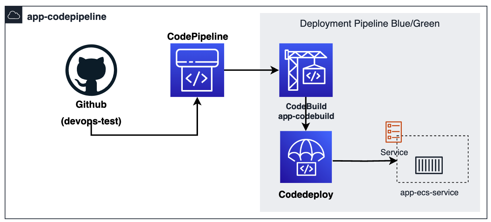

# DevOps Infra

## How to do

### Install

- **aws-cli**: is a package provides a unified command line interface to Amazon Web Services.

Refer how to install [aws-cli](https://docs.aws.amazon.com/cli/latest/userguide/getting-started-install.html) base on your OS.

- **terraform**: is a tool for building, changing, and versioning infrastructure safely and efficiently.

Refer how to install [terraform](https://learn.hashicorp.com/tutorials/terraform/install-cli) base on your OS.

### Config

- Create AWS profile

  ```bash
    aws configure --profile {{ project }}-{{ env }}
        AWS Access Key ID: <your-access-key>
        AWS Secret Access Key: <your-secret-access-key>
        Default region name: {{ region }}
        Default output format: json
  ```

- Check ~/.aws/credentials

  ```bash
  [{{ project }}-{{ env }}]
  aws_access_key_id =
  aws_secret_access_key =
  ```

- Set ~/.aws/config

  ```bash
  [profile {{ project }}-{{ env }}]
  output = json
  region = {{ region }}
  ```

- Create manually [AWS S3 bucket](https://docs.aws.amazon.com/cli/latest/reference/s3api/create-bucket.html)

  ```bash
  aws s3api create-bucket --bucket {{ project }}-{{ env }}-iac-state --region {{ region }} --create-bucket-configuration LocationConstraint={{ region }} --profile {{ project }}-{{ env }}
  aws s3api put-bucket-versioning --bucket {{ project }}-{{ env }}-iac-state --versioning-configuration Status=Enabled --region {{ region }} --profile {{ project }}-{{ env }}
  aws s3api put-public-access-block \
      --bucket {{ project }}-{{ env }}-iac-state \
      --public-access-block-configuration "BlockPublicAcls=true,IgnorePublicAcls=true,BlockPublicPolicy=true,RestrictPublicBuckets=true" \
      --region {{ region }} --profile {{ project }}-{{ env }}
  ```

### Structure

```bash
terraform/
├── envs/
│   ├── dev/
│   └── prd/
└── modules/
dependencies/
├── templates/
├── scripts/
└── tests/
application/
├── ops/
└── docker/
```

### Diagram


### CI/CD Pipeline



- Codebuild:
  - Build image to ECR
  - Run Unit Testing: run pytest with built image by using docker container
  - Push image to ECR
  - Prepare artifact for CodePipeline
- CodeDeploy:
  - Get artifact from CodeBuild include image detail and task definition of application
  - Deploy to ECS Fargate(Blue/Green Strategy)
